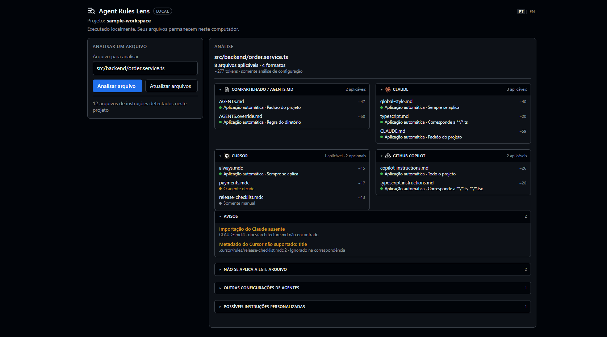

# Agent Rules Lens

[Português](README.md) | English

[Repository](https://github.com/williamosilva/Agent-Rules-Lens) · [Issues](https://github.com/williamosilva/Agent-Rules-Lens/issues)

See which AI instruction files apply to the file you're editing.

One project can carry `AGENTS.md`, Claude rules, Cursor rules and Copilot instructions at the same time. Each format scopes differently: some cascade down the directory tree, some depend on a glob in the frontmatter, some cover the whole repository. Open `src/backend/order.service.ts` and answering "which of these applies right now?" is already work.

Agent Rules Lens collects those files and tells you, for the file you pick, which ones apply and why.


## What it claims, and what it only detects

When it says a rule applies, that comes from a documented path, a directory hierarchy, a glob or a metadata field it knows how to interpret. It never guesses from the file name, and never reads a rule's prose to judge relevance.

A `typescript.md` with no `paths` field applies to every file, Python included. A Cursor rule named `frontend.mdc` whose globs point at `src/backend/**` applies to the backend. The name is not evidence.

Formats from other tools are **detected** and listed, but with no claim about applicability — their resolution rules are not implemented yet. Saying "we found your Windsurf rules" is honest; saying "these Windsurf rules apply here" would not be.

It analyses the configuration files in the project. It does not inspect the private, running context of Claude, Cursor, Copilot or any other agent.

## Choose how you want to use it

| I want to | Option |
| --- | --- |
| See the rules inside VS Code | Extension |
| Analyse a project in the browser | Local dashboard with `arl` |
| Try it without using a project of my own | Demo workspace |
| Feed the analysis into another process | JSON output |

These are two independent things:

- `npm run install:local` **installs the compiled extension into VS Code**. After that the sidebar exists in every project you open, and it follows the workspace and the file you're editing on its own.
- `arl` **opens a dashboard in the browser** for whatever directory the terminal is in. It is a separate process and does not need the extension to be installed.

Neither one needs the other.

## Using the VS Code extension

[Install from the VS Code Marketplace](https://marketplace.visualstudio.com/items?itemName=williamosilva.agent-rules-lens)

Or from the terminal:

```powershell
code --install-extension williamosilva.agent-rules-lens
```

To work from the source, you can build and install the `.vsix` locally:

```powershell
git clone https://github.com/williamosilva/Agent-Rules-Lens.git
cd Agent-Rules-Lens
npm install
npm run install:local
```

In that case, reload the VS Code window afterwards:

```text
Ctrl + Shift + P
Developer: Reload Window
```

Either way, the sidebar is available in any project you open. Click the Agent Rules Lens icon in the Activity Bar: it follows whichever file is focused, so switching tabs re-runs the comparison. Clicking a rule opens the file; clicking a warning jumps to the line it reports. `PT | EN` in the header changes the language.

## Using the local dashboard in the browser

```powershell
git clone https://github.com/williamosilva/Agent-Rules-Lens.git
cd Agent-Rules-Lens
npm install
npm run local:link
```

`npm run local:link` makes the `arl` command available on your machine. Then, in the project you want to analyse:

```powershell
cd C:\path\to\project
arl
```



Cases that work:

```powershell
arl                          # analyse the current directory
arl src\app.ts               # start with that file selected
arl ..\other-project         # analyse another project
arl --json src\app.ts        # print the analysis and exit
arl --locale pt-BR           # interface in Portuguese
arl --locale en              # interface in English
arl --no-open                # do not open the browser
arl --help
```

Worth knowing:

- `arl` uses the current directory as the project, so there is usually nothing to pass;
- a file can be given directly to start with it analysed;
- the browser opens on its own unless you pass `--no-open`;
- `Ctrl+C` stops the server;
- everything runs on `127.0.0.1`, and no file is sent to any external service.

There is also `--workspace` and `--file` for the cases where the default doesn't fit, and `--port` to pin the port.

Distribution through npm is being prepared. Until then, the clone above is the way in.

## Demo

To see the result without using a project of your own:

```powershell
npm run demo
```

Or, once `arl` is available:

```powershell
cd examples\sample-workspace
arl src\backend\order.service.ts
```

The demo workspace holds deliberate examples of `AGENTS.md`, `AGENTS.override.md`, Claude, Cursor and GitHub Copilot, plus a missing-import warning, a detected-only configuration and a file that looks like a custom instruction. They exist to show every case at once — a real project needs none of it.

## Supported formats

| Format | Detected | Applicability evaluated |
| --- | ---: | ---: |
| `AGENTS.md`, `AGENTS.override.md` | Yes | Yes |
| Claude — `CLAUDE.md`, `CLAUDE.local.md`, `.claude/CLAUDE.md`, `.claude/rules/**/*.md` | Yes | Yes |
| Cursor — `.cursor/rules/**/*.mdc` | Yes | Yes |
| GitHub Copilot — `.github/copilot-instructions.md`, `.github/instructions/**/*.instructions.md` | Yes | Yes |
| Gemini, Qwen | Yes | No |
| Windsurf, Cline, Roo Code, Continue | Yes | No |
| Kiro, Amazon Q Developer, Junie, Augment | Yes | No |
| Replit Agent, Qoder, CodeBuddy, Trae, Zed | Yes | No |
| Hand-written names like `RULES.md` or `AI_RULES.md`, and files under `.ai/rules/` | As candidates | No |

**Detected** means the file was recognised and attributed to a tool. **Applicability evaluated** means that format's documented resolution rules are implemented. A detected-only format stays out of the main count.

Agent definitions, prompts and skills — `.github/agents/*.agent.md`, `.claude/agents/**`, `.github/prompts/*.prompt.md`, `.agents/skills/**/SKILL.md` — are recognised precisely so they are never listed as rules.

## Status meanings

| State | What it means |
| --- | --- |
| Automatic | Matches the open file through a documented rule |
| Agent decides | The agent evaluates relevance, based on a `description` |
| Manual only | Loaded only when you mention it explicitly |
| Not applicable | The rule was understood, but its scope doesn't cover this file |
| Cannot determine | A field that decides applicability is malformed |
| Invalid configuration | The file itself is malformed |
| Applicability not analyzed | Detected configuration: the tool is known, but its resolution rules are not implemented |
| Loading not verified | A candidate or user-declared file: no agent is known to load it |

Only *Automatic* rules reach the count and the token total.

## Tokens

The token number is a rough estimate: one token per four characters of the rule body, with no real tokenizer involved. It gives a sense of size, not a prediction of billing. It also isn't a single context window — each format is read by its own agent, so the per-format numbers say more than the sum. Detected and candidate files contribute nothing.

## Custom patterns

If you keep instructions in a file the catalog doesn't know, add its glob in the VS Code settings:

```json
{
  "agentRulesLens.customInstructionPatterns": [
    "**/AI_RULES.md",
    ".ai/rules/**/*.md"
  ]
}
```

Matching files appear under *Possible custom instructions*. The setting only asks for those files to be watched; it does not make Claude, Cursor or anything else load them.

## Privacy and security

Everything runs locally. There are no network requests, no telemetry and no content sent to any service.

The extension's sidebar is a webview under a restrictive Content-Security-Policy: `default-src 'none'`, scripts only under a per-render nonce, images only from the extension's own files. Tool marks are bundled, not fetched.

The local dashboard listens on `127.0.0.1` only, requires a token generated for that run, and the page runs under `default-src 'self'` with no `unsafe-inline` and no `unsafe-eval`. The browser never receives an absolute path: each row carries an opaque handle that only the server can resolve, and always inside the project you pointed it at.

## Limitations

- Multi-folder projects are analysed on the first folder only.
- Detected-only formats have no applicability evaluated, and candidate files carry no confirmation that any agent loads them.
- The local dashboard refreshes on demand: use **Refresh** after changing a rule file. The extension, on the other hand, watches for changes itself.
- The dashboard is read-only. Clicking a rule opens a preview inside the page, not an editor.
- The preview refuses files over 512 KB.
- Directories reached through a symlink are not traversed, so rules that exist only behind a link are invisible to local mode.
- The language chosen in the dashboard belongs to the server, so local tabs open at the same time share the same choice.
- Token counts are estimates.
- The CLI's npm package is not published yet.
- And the main caveat: this analyses configuration, not the live context an agent assembled. Agents can also change how they load instructions at any time.

## Feedback and issues

Found an instruction format that should be recognised, a rule that resolves incorrectly, or a problem in the interface? [Open an issue](https://github.com/williamosilva/Agent-Rules-Lens/issues/new).

When reporting, include the agent or tool, the relevant path and the behaviour you expected. Do not include private instructions, proprietary code, credentials or other sensitive project data.

## Development

```powershell
npm run check         # typecheck and tests
npm run compile       # bundle the extension
npm run package       # build the .vsix
npm run local:build   # bundle the local mode
npm run local:check   # local mode tests
npm run demo          # open the dashboard on the sample workspace
```

`F5` opens an Extension Development Host already pointed at `examples/sample-workspace`, which is where the examples of each format live. The harder cases used by the tests are under `test/fixtures/`.

## License and trademarks

The extension is distributed under the [MIT License](LICENSE).

The logos belong to their respective owners and are used only for identification. This project is not affiliated with, endorsed by, or sponsored by any of the recognized tools. The source, license, and retrieval date of each logo are documented in [`THIRD_PARTY_NOTICES.md`](THIRD_PARTY_NOTICES.md) and [`media/icons/agents/sources.json`](media/icons/agents/sources.json). If you represent one of these projects and would like an asset or credit changed, [open an issue](https://github.com/williamosilva/Agent-Rules-Lens/issues/new).
