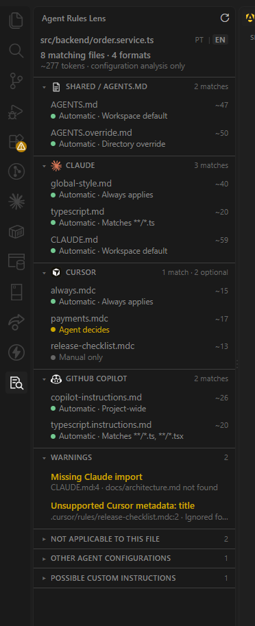

# Agent Rules Lens

English | [Português](README.pt-BR.md)

[Repository](https://github.com/williamosilva/Agent-Rules-Lens) · [Issues](https://github.com/williamosilva/Agent-Rules-Lens/issues)

See which AI instruction files match the code you're working on.

A repository can carry `AGENTS.md`, Claude rules, Cursor rules, Copilot instructions and other agent configuration at the same time. Agent Rules Lens collects them in one VS Code sidebar and explains why each one matches the file you have open — or why it doesn't.



## The problem

Instruction files are scattered, and their scopes are not obvious. `AGENTS.md` cascades by directory. A file under `.claude/rules/` may or may not carry a `paths` filter. A Cursor `.mdc` behaves differently depending on three frontmatter fields. Copilot splits repository-wide instructions from per-glob ones.

Open `src/backend/order.service.ts` and a simple question gets hard: which of these applies right now, and which one wins when two cover the same directory?

## What it shows

The extension finds the instruction files it recognises, reads only the fields each format documents, and compares those scopes with the path you have open.

The sidebar groups the result by tool. Each section carries the tool's mark and a count; each row is two lines — file name and token estimate, then the state and the reason for it:

```
▾ CLAUDE                                   3 matches
    global-style.md                            ~40
    ● Automatic · Always applies

    typescript.md                              ~20
    ● Automatic · Matches **/*.ts
```

Then come warnings, and three sections that start collapsed: rules that were understood but don't match, configuration belonging to other agents, and files that look like hand-written instructions. Clicking a row opens the file; clicking a warning opens it at the reported line.

## What it does — and what it doesn't

Agent Rules Lens analyses files stored in the repository. It does not inspect the private, live context of Claude, Cursor, Copilot or any other running agent.

When it says a rule matches, that comes from a documented path, a directory hierarchy, a glob or a metadata field it knows how to interpret. It never guesses from the file name, and never reads the prose inside a rule to decide relevance.

That shows up in real cases. A `typescript.md` with no `paths` field applies to every file, Python included. A Cursor rule named `frontend.mdc` whose globs point at `src/backend/**` applies to the backend. The name is not evidence.

## A concrete example

With `src/backend/order.service.ts` open, the sidebar might list the root `AGENTS.md` as the workspace default, `src/backend/AGENTS.override.md` replacing the `AGENTS.md` beside it, a Claude rule matching `**/*.ts`, a Cursor rule with `alwaysApply: true`, and the repository-wide Copilot instructions.

The `src/backend/AGENTS.md` the override replaced moves to *Not applicable to this file*, with the reason: *Replaced by directory override*.

A `GEMINI.md` in the same repository is listed under *Other agent configurations*. The extension knows which tool owns it and nothing more, so it makes no claim about whether it applies.

## Features

- Analysis follows the active editor and refreshes when rule files or settings change.
- A reason on every row: `Workspace default`, `Directory override`, `Matches **/*.ts`, `Always applies`.
- Six outcomes instead of a binary on/off, including *cannot determine* when a field is malformed.
- Warnings for unusable metadata, unsupported frontmatter keys and Claude `@path` imports that point nowhere.
- Rough token estimate per rule and per format.
- English and Brazilian Portuguese, from a `PT | EN` control in the header.
- Bundled tool marks, light and dark themes, and a layout that survives a narrow sidebar.

## Supported formats

| Format | Detected | Applicability evaluated |
| --- | ---: | ---: |
| `AGENTS.md`, `AGENTS.override.md` | Yes | Yes |
| Claude — `CLAUDE.md`, `CLAUDE.local.md`, `.claude/CLAUDE.md`, `.claude/rules/**/*.md` | Yes | Yes |
| Cursor — `.cursor/rules/**/*.mdc` | Yes | Yes |
| GitHub Copilot — `.github/copilot-instructions.md`, `.github/instructions/**/*.instructions.md` | Yes | Yes |
| Gemini, Qwen | Yes | No |
| Windsurf, Cline, Roo Code, Continue | Yes | No |
| Kiro, Amazon Q Developer, Junie, Augment | Yes | No |
| Replit Agent, Qoder, CodeBuddy, Trae, Zed | Yes | No |
| Hand-written names like `RULES.md` or `AI_RULES.md`, and files under `.ai/rules/` | As candidates | No |

**Detected** means the file was recognised and attributed to a tool. **Applicability evaluated** means the extension implements that format's documented resolution rules. A detected format stays out of the main count until it has a resolver: "we found your Windsurf rules" is honest, "these Windsurf rules apply here" would not be.

Agent definitions, prompts and skills — `.github/agents/*.agent.md`, `.claude/agents/**`, `.github/prompts/*.prompt.md`, `.agents/skills/**/SKILL.md` — are recognised specifically so they are never listed as rules.

## Status meanings

| State | Meaning |
| --- | --- |
| Automatic | Matches the open file through a documented rule |
| Agent decides | The agent evaluates relevance, based on a `description` |
| Manual only | Loaded only when you mention it explicitly |
| Not applicable | The rule was understood, but its scope doesn't cover this file |
| Cannot determine | A field that decides applicability is malformed |
| Invalid configuration | The file itself is malformed |
| Applicability not analyzed | Detected configuration: the tool is known, its resolution rules are not implemented |
| Loading not verified | A candidate or user-declared file: no agent is known to load it |

Only *Automatic* rules reach the header count and the token total.

## Tokens

The token number is a rough estimate: one token per four characters of the rule body, with no real tokenizer involved. It gives a sense of size, not a prediction of billing. It also isn't a single context window — each format is read by its own agent, so the per-format numbers matter more than the sum. Detected and candidate files contribute nothing.

## Installation

The extension isn't published to the Marketplace, so install the `.vsix` directly.

```bash
npm run package
code --install-extension agent-rules-lens-0.1.0.vsix
```

`npm run package` builds the file in the project root; it isn't committed. The Extensions view works too: `...` menu → **Install from VSIX...**.

## Usage

Open a folder and a code file, then click the Agent Rules Lens icon in the Activity Bar. The sidebar follows whichever file is focused. Click a rule to open it, or a warning to jump to the line it reports. Use `PT | EN` in the header to change language.

## Custom instruction patterns

If you keep instructions in a file the catalog doesn't know, add its glob:

```json
{
  "agentRulesLens.customInstructionPatterns": [
    "**/AI_RULES.md",
    ".ai/rules/**/*.md"
  ]
}
```

Matching files appear under *Possible custom instructions*, labelled `User-declared · loading not verified`.

The setting only tells the Lens to watch those files. It doesn't make Claude, Cursor or anything else load them. Absolute paths and paths that escape the workspace are ignored, with a note in the output channel.

## Privacy and security

Everything runs locally against the open workspace. The extension makes no network requests and sends nothing to any AI service.

The sidebar is a webview under a restrictive Content-Security-Policy: `default-src 'none'`, scripts only under a per-render nonce, images only from the extension's own files. Tool marks are bundled rather than fetched, and every path the webview asks to open is checked against the current analysis first.

## Current limitations

Only the four formats marked above have full resolution. Everything else is detected, and its applicability is deliberately left unevaluated. Candidate files carry no confirmation that any agent loads them. Token counts are estimates.

Multi-folder workspaces analyse only the first folder. Configurable fallback file names are not guessed.

The `PT | EN` control switches the sidebar and messages immediately. Command titles and the setting description come from `package.nls.json` and follow VS Code's own display language, so those need a window reload.

And the core caveat: this analyses configuration, not the live context an agent assembled. Agents can change how they load instructions at any time.

## Feedback and issues

Found an instruction format that should be recognized, a rule that resolves incorrectly, or a problem in the sidebar? [Open an issue](https://github.com/williamosilva/Agent-Rules-Lens/issues/new).

When reporting a problem, include the agent or tool, the relevant file path and the behavior you expected. Do not include private instructions, source code, credentials or other sensitive project data.

## Development

```bash
git clone https://github.com/williamosilva/Agent-Rules-Lens.git
cd Agent-Rules-Lens
npm install
```

Then, from the project root:

```bash
npm run check      # typecheck and tests
npm run compile    # bundle to dist/
npm run package    # build the .vsix
```

`F5` opens an Extension Development Host on `examples/sample-workspace`, which has one of everything: a matching rule, an override, a detected-only `GEMINI.md`, a candidate `AI_RULES.md`, and an agent definition that must never appear as a rule. Harder cases live under `test/fixtures/`.

## Architecture

```
catalog → discovery → parsing → resolution → view model → webview
```

The catalog declares every file pattern and the tool that owns it. Discovery finds those files; parsers read only the frontmatter fields each format documents; the resolver compares the result against the open file and assigns a status; the view model turns that into finished, translated strings. The webview renders them and decides nothing.

Catalog, parsers, resolver and view model import no `vscode` API, which is what makes them testable directly.

## License and trademarks

The extension is MIT licensed; see `LICENSE`.

Tool marks are the property of their owners and are used for identification only. This project is not affiliated with, endorsed by or sponsored by any of the tools it recognises. Each mark's source, licence and retrieval date is recorded in [`THIRD_PARTY_NOTICES.md`](THIRD_PARTY_NOTICES.md) and in `media/icons/agents/sources.json`. If you represent one of these projects and want an asset or attribution changed, [open an issue](https://github.com/williamosilva/Agent-Rules-Lens/issues/new).
